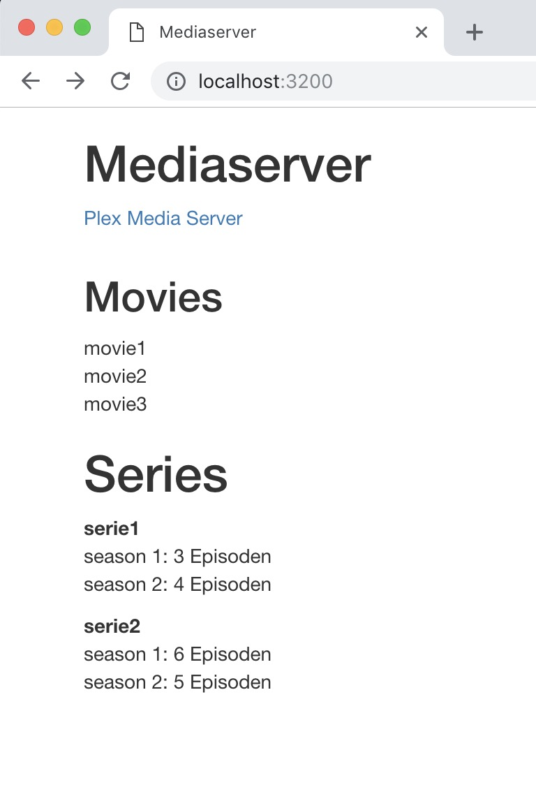

# Mediaparser written in Node and Express
## Description
This is a hobby project which parses movies and series in a given directory structure, similar as e.g. Plex does it.
After parsing the paths, the app generates a HTML file and serves it to the browser.



## Setup
The directory structure can be changed in [config.json](https://github.com/andersennl/media-parser-node/blob/master/config.json).
The app currently supports one movie and one series directory, which have to be present. Future versions of this project might support less and more directories.

### config.json
This is an example `config.json`

```json
{
  "moviesPath":"/Users/you/mediaparser/media/movies",
  "seriesPath":"/Users/you/mediaparser/media/series"
}
```

Run the app with
```bash
node dist/app.js
```
Open your browser with the following url `http://localhost:3200`.

## Development
There are two other versions of this project written in [Java](https://github.com/andersennl/media-parser-java), and [Python](https://github.com/andersennl/media-parser-python). The Node version is the only one actively being developed though.

## Contribution
Feel free to create an issue or pull request.
